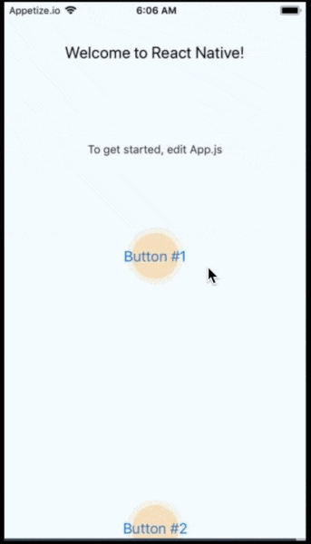
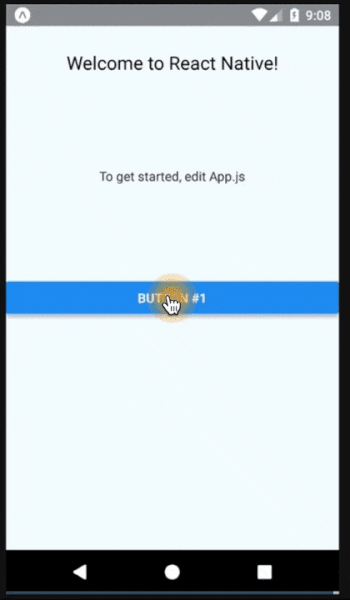

# react-native-hotspot

[](https://badge.fury.io/js/react-native-hotspot)

A React Native component that displays hotspots over desired components to help lead your users through an onboarding flow or direct them towards new UI elements




[Examples](https://github.com/lawnstarter/react-native-hotspot/tree/master/example)

[Run example](https://snack.expo.io/@lfkwtz/react-native-hotspot)

## Getting Started

### Installing

`npm install react-native-hotspot`

### Using

```js
import { RNHotspot, RNHotspotHelper } from "react-native-hotspot";

// in your screen's constructor, use the helper with an array of onPress actions you want your hotspots to trigger
this.componentRefs = RNHotspotHelper([
    () => {
        // here you can drop in whatever action(s) you want to occur on tap of the hotspot.
        // you'll also likely want to use local storage here and/or an api call to mark each one as seen.
        Alert.alert(null, "This button does this thing.");
    },
    () => {
        Alert.alert(null, "This button does other thing.");
    }
]);

// drop the component below the outer wrapping parent of your screen
<RNHotspot componentRefs={this.componentRefs} />


// expose the refs in the same order as the array defined above
<Button
    title="Button #1"
    onPress={() => {}}
    ref={this.componentRefs[0].ref}
/>
<Button
    title="Button #2"
    onPress={() => {}}
    ref={this.componentRefs[1].ref}
/>
```

## Testing

This component has been tested on React Native v0.57

## License

react-native-hotspot is [MIT licensed](https://github.com/lawnstarter/react-native-hotspot/tree/master/LICENSE) and built with :heart: in Austin, TX by the team at [LawnStarter](https://lawnstarter.com)
